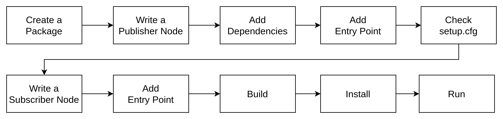
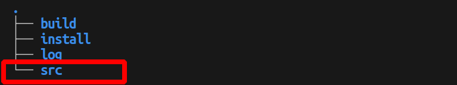
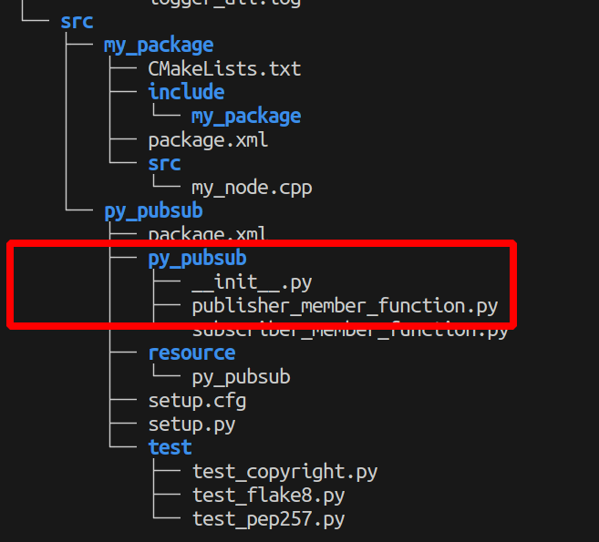
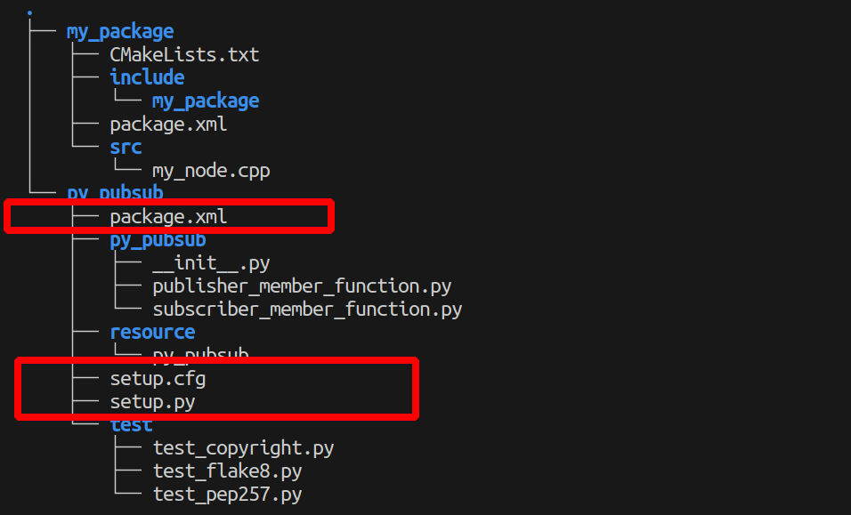

# ros-notes

## ROS2 Write A Publisher-Subscriber Node Using Python



1. Create  package
```
ros2 pkg create --build-type ament_python <package name>
``` 

 


2. Write a publisher node

[publisher_member_function](./publisher_member_function.py)

 

3. Add Dependencies

 

open `package.xml` and fill <description>, <maintainer> and <license> tags:

```
<description>Examples of minimal publisher/subscriber using rclpy</description>
<maintainer email="you@email.com">Your Name</maintainer>
<license>Apache License 2.0</license>
```

Add a new line after the `ament_python` buildtool dependency 
```
<exec_depend>rclpy</exec_depend>
<exec_depend>std_msgs</exec_depend>
```

Match `setup.py` and `package.xml` these fields  `maintainer`, `maintainer_email`, `description` and `license`

Add an  entry point
```
entry_points={
        'console_scripts': [
                'talker = py_pubsub.publisher_member_function:main',
        ],
},
```

4. Write subscriber node 
like this,

[subscriber_member_function](./subscriber_member_function.py)

5. Build and Run

check dependencies
```
rosdep install -i --from-path src --rosdistro <distro> -y
```

Build
```
colcon build --packages-select py_pubsub
```

Install
```
. install/setup.bash
```

Run
```
ros2 run py_pubsub talker
```


## ROS Command

```
rosbag info xxx.bag 

rosbag play <bag 1> <bag 2>

rostopic list

rostopic echo <topic name>
```