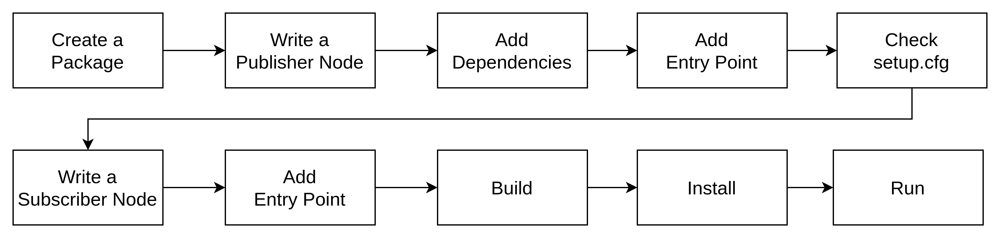

# ros-notes

## ROS2 Write A Publisher-Subscriber Node Using Python



1. Create  package
```
ros2 pkg create --build-type ament_python <package name>
``` 

2. Write a publisher node

[publisher_member_function](./publisher_member_function.py)


## ROS Command

```
rosbag info xxx.bag 

rosbag play <bag 1> <bag 2>

rostopic list

rostopic echo <topic name>
```